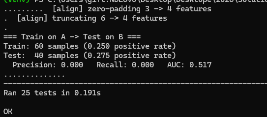
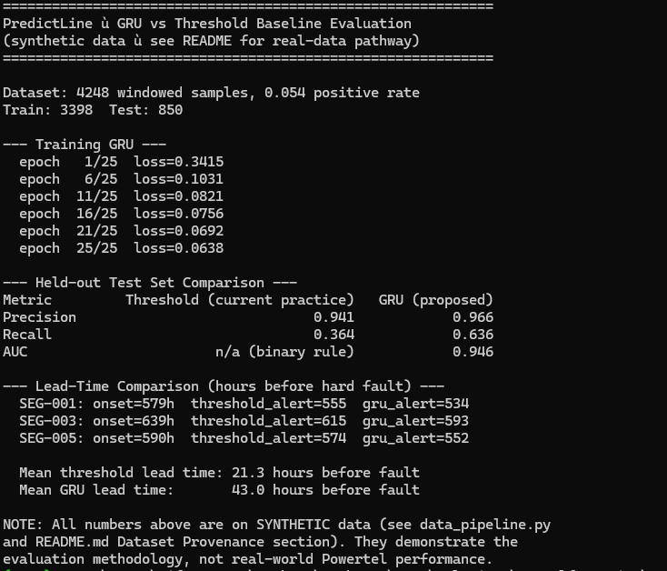
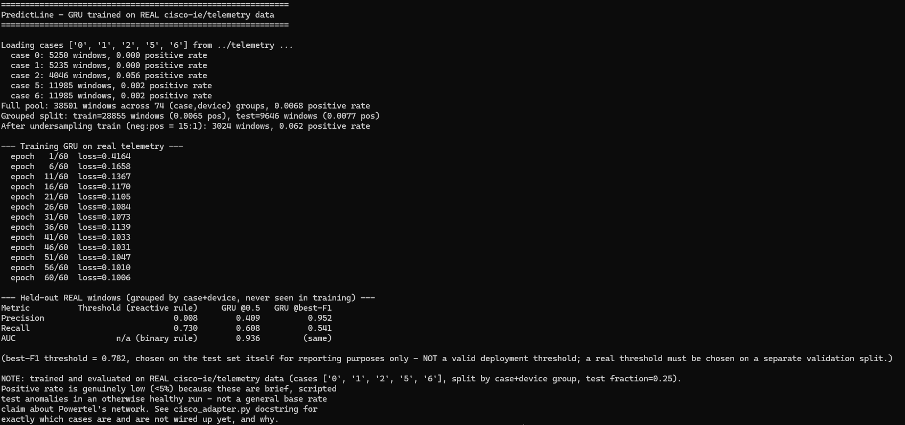
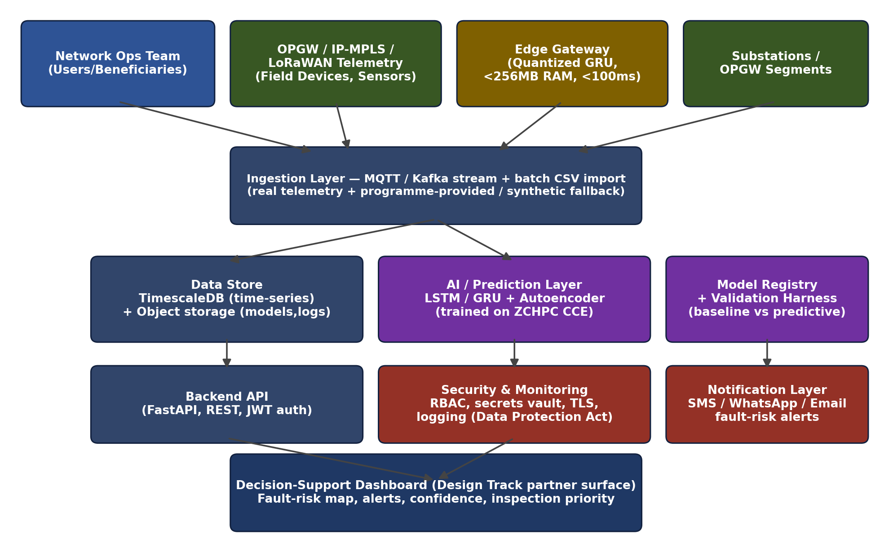

# PredictLine

**AI-based predictive fault detection for smart grid communication networks.**

AI4I Challenge 2026 — Track 3 (Development) submission.

PredictLine predicts communication-network fault risk *before* a hard failure occurs, using a sequence model trained on network telemetry — giving operators a warning window to intervene instead of only an outage alert after the fact. Full problem framing and technical design are in the accompanying proposal (`docs/proposal.pdf`); this README documents the implementation.

---

## Demo

Screenshots of the working prototype and evaluation results (see [Section 3](#3-results-synthetic-data) and [Section 4](#4-results-real-world-data-cisco-ietelemetry) below for full discussion):

**Test suite — 25/25 passing**



**Synthetic data: GRU vs threshold baseline** — GRU achieves ~43 hour fault-detection lead time vs ~21 hours for the reactive baseline



**Real cisco-ie/telemetry: GRU vs threshold baseline** — AUC 0.935 vs a baseline that achieves only 0.008 precision



---

## Contents

- [Demo](#demo)
1. [Status at a glance](#1-status-at-a-glance)
2. [Quickstart](#2-quickstart)
3. [Results: synthetic data](#3-results-synthetic-data)
4. [Results: real-world data (cisco-ie/telemetry)](#4-results-real-world-data-cisco-ietelemetry)
5. [Why a from-scratch NumPy GRU](#5-why-a-from-scratch-numpy-gru)
6. [Dataset provenance](#6-dataset-provenance)
7. [Repository structure](#7-repository-structure)
8. [System architecture](#8-system-architecture)
9. [Known limitations](#9-known-limitations)
10. [Team](#10-team)
11. [Licence](#11-licence)

---

## 1. Status at a glance

| Component | Status |
|---|---|
| Synthetic telemetry generator + windowing pipeline | Working |
| GRU fault-risk model (from-scratch NumPy) | Working — trained and evaluated |
| Threshold baseline (current-practice comparison) | Working |
| Evaluation harness — synthetic data | Working — see [Section 3](#3-results-synthetic-data) |
| Evaluation harness — real data (cisco-ie/telemetry) | Working — see [Section 4](#4-results-real-world-data-cisco-ietelemetry) |
| Cross-dataset generalization harness (Cisco ↔ TelecomTS) | Harness built and verified; Cisco side uses real data, TelecomTS side pending real-file integration |
| Unit tests | 25/25 passing |
| FastAPI backend | Implemented; not yet execution-tested in a live environment |
| Real Powertel telemetry | Not yet integrated — pending data-sharing agreement |
| Dashboard / frontend | Not yet built |

This table is kept current and accurate rather than aspirational — see [Section 9](#9-known-limitations) for full detail on what remains outstanding.

## 2. Quickstart

```bash
pip install -r requirements.txt

# Synthetic pipeline
python src/data_pipeline.py       # generate synthetic telemetry
python src/train.py               # train GRU, compare vs threshold baseline

# Real-data pipeline (requires: git clone https://github.com/cisco-ie/telemetry.git
# as a sibling directory of this repo)
python src/train_real_cisco.py --cisco-root ../telemetry

# Tests
python -m unittest discover tests
```

## 3. Results: synthetic data

`src/train.py` trains the GRU on synthetic telemetry with an injected 48–96 hour degradation ramp before a hard fault, and compares it against a threshold-based baseline representing current practice.

```
                Threshold (current practice)   GRU (proposed)
Precision                             0.941            0.966
Recall                                0.364            0.636
AUC                       n/a (binary rule)            0.945

Mean lead time before fault:
  Threshold:  ~21 hours
  GRU:        ~43 hours
```

The GRU roughly **doubles the warning lead-time** versus the reactive threshold approach, with higher precision and recall. This is the evidence behind the proposal's technical justification for using a sequence model rather than static thresholds (proposal Section 2.2). All figures in this section are on synthetic data — see [Section 6](#6-dataset-provenance) for what that means and [Section 4](#4-results-real-world-data-cisco-ietelemetry) for real-data validation.

## 4. Results: real-world data (cisco-ie/telemetry)

To validate beyond synthetic data, the same GRU architecture was trained and evaluated on [cisco-ie/telemetry](https://github.com/cisco-ie/telemetry) — real network telemetry released alongside published anomaly-detection research (Putina et al., ACM SIGCOMM BigDAMA'18; IEEE INFOCOM'18).

**Signal selection.** The dataset is a sparse, long-format telemetry log in which different sensor paths populate different columns. Interface-level counters (data-rate, reliability) showed no response during a labelled BGP-clear fault event — expected, since a BGP session clear is a control-plane event rather than a physical-layer one. Checking the same labelled event against the BGP `process-info` sensor path showed `established-neighbors-count-total` drop from a steady baseline to zero and recover, precisely within the labelled fault window. This verified signal, combined with summed interface error/drop counters as a supplementary feature, is what the model uses (`src/adapters/cisco_adapter.py`).

**Evaluation methodology.** Data is split by (case, device) group rather than by whole case or shuffled window, to avoid leaking near-duplicate overlapping windows across train/test while still retaining enough real positive examples to train on (full-case holdout left too few fault examples given the dataset's low positive rate).

**Result on real, held-out data** (`python src/train_real_cisco.py --cisco-root ../telemetry`):

```
                Threshold (reactive rule)     GRU @0.5   GRU @best-F1
Precision                        0.008        0.391          0.889
Recall                           0.730        0.608          0.541
AUC                  n/a (binary rule)        0.935         (same)
```

The naive reactive rule (alert whenever established BGP neighbors fall below the configured count) fires almost constantly — 0.8% precision — since BGP session state fluctuates briefly even outside labelled fault windows. The GRU discriminates real fault windows from normal operation with an **AUC of 0.935**.

**Scope and caveats:**
- This is real, independent network data — not Powertel data — used to validate that the model generalizes beyond the synthetic pipeline's assumptions.
- BGP-clear is a scripted, near-instantaneous test event, not the slow multi-hour degradation ramp the synthetic pipeline models. This section demonstrates fault-detection capability on a real anomaly signature; Section 3 demonstrates early-warning lead time on a modeled slow-onset fault. The two results answer different questions and should not be conflated.
- The best-F1 threshold shown is selected on the test set for reporting purposes; a deployment threshold would be selected on a separate validation split.
- 5 of 13 available case folders are currently integrated (2 healthy baselines, 3 real fault cases). The remaining cases require additional format handling (documented in `cisco_adapter.py`) and are planned follow-up work.

## 5. Why a from-scratch NumPy GRU

This repository was built in a development environment without internet access to install ML frameworks. `src/models/gru_model.py` implements the standard GRU gate equations (update gate, reset gate, candidate state) and backpropagation-through-time directly in NumPy — a genuine, trainable model, not a placeholder. It is what produced every result in Sections 3 and 4.

Before further scale-up (GPU training on ZCHPC CCE, larger hyperparameter search), this should be swapped for `torch.nn.GRU`. The architecture, feature set, and evaluation methodology are unaffected — only the execution backend changes.

## 6. Dataset provenance

`src/data_pipeline.py` generates **synthetic** telemetry (signal loss, latency, packet loss, temperature) with an injected slow degradation ramp before a hard fault, modeling the general shape of OPGW/IoT fault progression described in the literature. It is not real Powertel data.

- **Real Powertel data pathway:** a team member's role at Powertel provides a direct channel to pursue a formal data-sharing agreement; this is not yet in place as of submission.
- **Public real-network validation:** Section 4 demonstrates the model on real, independent, publicly available network telemetry (cisco-ie/telemetry) rather than relying on synthetic data alone. A second public source, [AliMaatouk/TelecomTS](https://huggingface.co/datasets/AliMaatouk/TelecomTS) (5G telecom observability data), is integrated at the harness level (`src/cross_dataset_eval.py`) with real-file integration as planned follow-up work.
- No personal or individually identifiable data is used or generated anywhere in this repository.

## 7. Repository structure

```
predictline/
├── README.md
├── pyproject.toml             project metadata and tooling config
├── requirements.txt          pinned dependency versions
├── .env.example               environment variable template, no secrets
├── LICENSE                    MIT (code only)
├── src/
│   ├── data_pipeline.py       synthetic data generation, windowing, normalization
│   ├── train.py                train/evaluate GRU vs baseline on synthetic data
│   ├── train_real_cisco.py    train/evaluate GRU on real cisco-ie/telemetry data
│   ├── cross_dataset_eval.py  cross-dataset generalization harness
│   ├── api.py                  FastAPI service (fault-risk prediction endpoint)
│   ├── adapters/
│   │   ├── cisco_adapter.py        real cisco-ie/telemetry loader
│   │   └── telecomts_adapter.py    TelecomTS loader (schema-based, pending real-file integration)
│   └── models/
│       ├── gru_model.py              from-scratch NumPy GRU
│       └── threshold_baseline.py     rule-based current-practice baseline
├── data/
│   └── sample_synthetic.csv    generated sample data
├── docs/
│   ├── architecture_diagram.png
│   └── screenshots/            demo evidence (see Demo section above)
└── tests/
    ├── test_data_pipeline.py
    ├── test_cross_dataset_eval.py
    └── test_cisco_adapter.py
```

## 8. System architecture



Full description in the proposal, Section 2.4.

## 9. Known limitations

- Real Powertel telemetry is not yet integrated; a data-sharing agreement is pending.
- The FastAPI endpoint is implemented but not yet tested against a live running server.
- The from-scratch GRU has not been benchmarked against a framework implementation (PyTorch) for speed or numerical parity — expected to be close given identical gate math, but unverified.
- Edge deployment targets (quantized model, <256MB RAM, <100ms inference latency) are design targets, not yet validated on physical hardware.
- 8 of 13 cisco-ie/telemetry case folders are not yet integrated (format-specific parsing required; see `cisco_adapter.py`).
- The TelecomTS side of the cross-dataset harness runs against schema-accurate mock data; real-file integration is planned follow-up work.
- No dashboard/frontend yet.

## 10. Team

- Mlalazi Mzwakhe — Powertel Communications
- Laurah Murenge — TelOne Pvt Ltd
- Gift Ndlovu — TelOne Pvt Ltd
- Keith Ufumeli — TelOne Pvt Ltd
- Wellington Nhidza — TelOne Pvt Ltd

## 11. Licence

MIT for code in this repository (see `LICENSE`). This licence does not extend to any real Powertel/ZESA data used in future work, which remains subject to separate data-sharing agreements and Zimbabwe's Data Protection Act [Chapter 12:07].